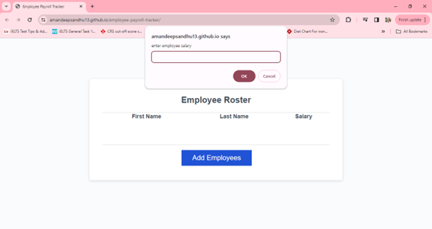
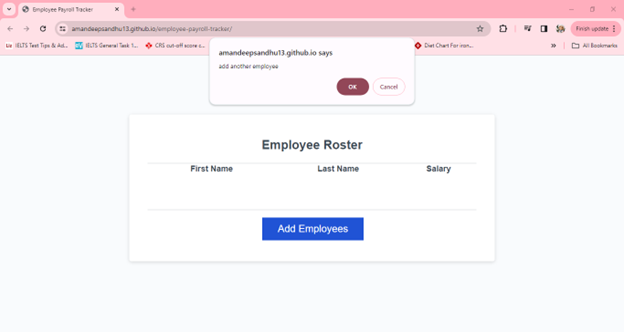
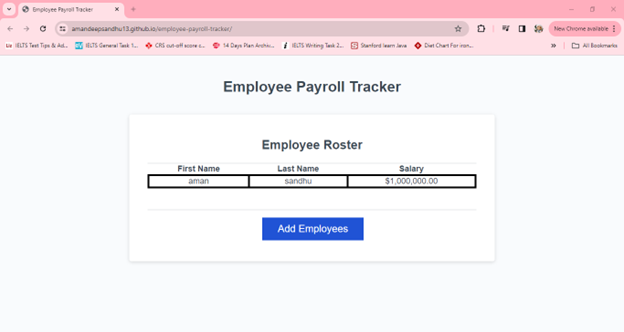
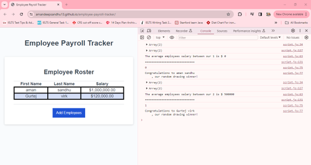

# employee-payroll-tracker

    employee-payroll-tracker application is to add employee record from user interface and displayes all employees data First name, last name and salary on the user interface. It also calculates the employees's avg salary and also provide functionality to randomly select employee as a draw winner.

### When click on the add button it prompts to enter employee first name, last name and salary only in number format.

    Following are the screenshot of the application:

    

    

    

    

    
### There is 'collectEmployees' return employeesArray and it asks for the employee data. then if want add another employee again it will prompt to get another employee data.

### if don't want to add another employee then it will render all the added employees data and displayes in a table.

### 'displayAverageSalary' displays the average salary of employees

### to get the one employee to selected from the draw 'random number is generated from the added list of employees

    This application gets the employee record from user interface and displayes the user data First name, last name and salary on the user interface. It also calculates the employees's avg salary and choose the random employee as a draw winner.

## Modified the starter code

### When click on the add button it prompts to enter employee first name, last name and salary only in number format.

### There is 'collectEmployees' return employeesArray and it asks for the employee data. then if want add another employee again it will prompt to get another employee data.

### if don't want to add another employee then it will render all the added employees data and displayes in a table.

### 'displayAverageSalary' displays the average salary of employees

### to get the one employee to selected from the draw 'random number is generated from the added list of employees
